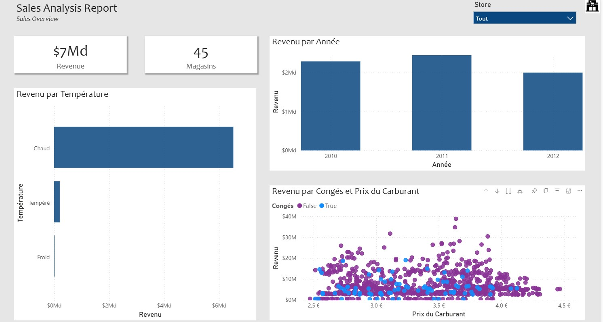

# Retail-Performance-Dashboard

 
Figure 1 : Page *Home* présentant la synthèse des ventes et l'impact des facteurs environnementaux.
***

## 📜 Contexte
Dans le cadre d'une analyse pour une enseigne de grande distribution, l'enjeu est de piloter la performance commerciale de *45 magasins*. Ce projet transforme des données brutes de ventes, de météo et de contexte économique en insights stratégiques pour optimiser la prise de décision.
***

## 🎯 Objectifs du Projet
L'objectif principal est de fournir une vision claire au PCA sur les leviers de croissance :

* *Analyse de la Saisonnalité* : Identifier l'impact réel des semaines de congés (*IsHoliday*) sur le chiffre d'affaires.
* *Évaluation de l'Élasticité* : Mesurer la sensibilité des clients face à la variation du *Prix du Carburant*.
* *Segmentation Climatique* : Corréler les performances selon les *Tranches de Température* (Froid, Tempéré, Chaud).
* *Ranking Dynamique* : Identifier les *Top Performers* du réseau grâce à un système de classement automatisé.

***

## 📂 Données
Le projet utilise le dataset historique de Walmart, croisant plusieurs dimensions :

* *Sales* : Données de ventes hebdomadaires par magasin.
* *Features* : Facteurs externes (Météo, Fuel Price, CPI, Unemployment).
* *Stores* : Métadonnées sur la taille et le type des magasins (A, B, C).
* *Période* : Analyse couvrant les années 2010 à 2012.

***

## 🛠️ Stack Technique
* *Microsoft Power BI* : Outil principal de visualisation et de reporting.
* *Power Query* : Nettoyage (ETL) et création de clés composites pour lier les facteurs externes aux ventes.
* *DAX (Data Analysis Expressions)* : Création de mesures complexes pour le ranking et la segmentation.

***
## ⚙️ Méthodologie & Etapes de réalisation 
Le projet a suivi un cycle complet de traitement de la donnée, de la préparation à la visualisation finale.

* *Traitement & Nettoyage (ETL) :* Utilisation de Power Query pour transformer les exports bruts, gérer les types de données et assurer la qualité de la base.
* *Modélisation des données :*
   *  Création d'une Table de Dates (Calendrier) personnalisée pour permettre des analyses temporelles précises.
  *  Mise en place des relations entre les tables pour structurer le modèle de données.
* *Calculs Statistiques (DAX) :* Écriture de mesures complexes pour extraire les indicateurs clés (Taux d'engagement, Conversion, Comparaisons MoM).
* *Design & Visualisation :* Conception des visuels pour une expérience utilisateur harmonieuse et professionnelle.

## 🏗️ Structure du Rapport
Le rapport est structuré en *2 pages interactives*, permettant une analyse granulaire allant de la performance globale aux spécificités de chaque point de vente.
### 🎬 Démonstration Vidéo

> Note : Cette animation montre la navigation fluide entre les pages et l'utilisation des filtres dynamiques.
### 🖼️ Zoom sur les Pages Clés

1.  *Performance Globale & Environnement :* Synthèse des indicateurs clés (Revenu Total, Nombre de Magasins) et analyse de l'impact des facteurs externes (Climat, Prix du Carburant) sur le volume d'affaires.
2.  *Top Magasins & Détails Tactiques :* Focus sur l'excellence opérationnelle via un classement dynamique (Top N) et analyse de la performance par type de magasin et périodes de congés.
***
## 💡 Résultats clés & Insights
L'analyse des données a permis de dégager des leviers d'optimisation concrets pour la stratégie commerciale de l'enseigne.

* *Résilience face à l'Inflation* : Identification d'une faible élasticité des ventes par rapport au prix du carburant ; les pics de consommation (jusqu'à *$40M*) sont maintenus même en période de prix élevés.
* *Saisonnalité & Congés* : Mise en évidence d'une corrélation directe entre les semaines IsHoliday et l'augmentation systématique du panier moyen, confirmant l'importance des promotions de vacances.
* *Optimisation par Segment Climatique* : La prédominance du segment *"Chaud"* (plus de $6Md de CA) suggère une adaptation ciblée des stocks de produits saisonniers dans les zones à forte température.
* *Benchmarking Interne* : Grâce au classement *RANKX, le **Store 20* est identifié comme le modèle de performance du réseau, offrant une base pour l'analyse des meilleures pratiques exportables.
---
> Note sur la confidentialité : Dans le cadre de ce projet d'analyse retail, toutes les données ont été traitées pour fournir une aide à la décision stratégique. Le fichier source (.pbix) présente la méthodologie de modélisation et le design des visuels.

